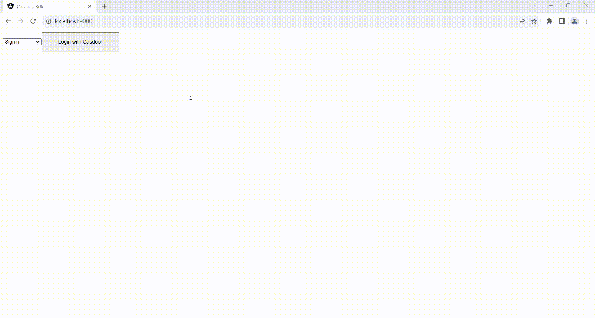

<h1 align="center" style="border-bottom: none;">Casdoor nodejs-angular Example</h1>

## Demo



## Architecture

The example includes two parts:

| Name     | SDK                 | Language             | Source code                                                        |
|----------|---------------------|----------------------|--------------------------------------------------------------------|
| Frontend | casdoor-angular-sdk | Javascript + React   | https://github.com/casdoor/casdoor-nodejs-angular-example/web      |
| Backend  | casdoor-nodejs-sdk  | JavaScript + Express | https://github.com/casdoor/casdoor-nodejs-angular-example/backend  |

## Installation

Example uses Casdoor to manage members. So you need to create an organization and an application for the example in a Casdoor instance.

### Necessary Configurations

#### Get the Code

```shell
git clone https://github.com/casdoor/casdoor
git clone https://github.com/casdoor/casdoor-nodejs-angular-example
```

#### Run Example

1. Run Casdoor
2. Configure
  - Backend
  - Frontend

#### Backend Config

Initialization requires 6 (or 5) parameters, which are all string type. Please refer to the official doc on [backend sdk configuration](https://casdoor.org/docs/how-to-connect/sdk#1-backend-sdk-configuration) for the latest change.

| Parameter        | Must | Description                                                                    |
|------------------|------|--------------------------------------------------------------------------------|
| endpoint         | Yes  | Casdoor Server URL, like `https://door.casdoor.com` or `http://localhost:8000` |
| clientId         | Yes  | Client ID for the Casdoor application                                          |
| clientSecret     | Yes  | Client secret for the Casdoor application                                      |
| jwtPublicKey     | Yes  | The public key for the Casdoor application's cert                              |
| organizationName | Yes  | The name for the Casdoor organization                                          |
| applicationName  | No   | The name for the Casdoor application                                           |

```js
// in ./backend/server.js
const authCfg = {
  endpoint: 'https://door.casdoor.com',
  clientId: '014ae4bd048734ca2dea',
  clientSecret: 'f26a4115725867b7bb7b668c81e1f8f7fae1544d',
  certificate: cert,
  orgName: 'casbin',
  appName: 'app-casnode',
}
```

#### Frontend Config

The first 4 parameters should use the same value as the Casdoor backend SDK. The last parameter redirectPath is relative path for the redirected URL, returned from Casdoor's login page. Please refer to the official doc on [frontend sdk configuration](https://casdoor.org/docs/how-to-connect/sdk#2-frontend-configuration) for the latest change.

```js
// in ./src/Setting.js
const config = {
  serverUrl: "https://door.casdoor.com",
  clientId: "014ae4bd048734ca2dea",
  organizationName: "casbin",
  appName: "app-casnode",
  redirectPath: "/callback",
};
```

After setting configurations up, install all dependencies by running `yarn install`. While Casdoor is operating, run the following scripts.

### Available Scripts

In the project directory, you can run:

```shell
npm run start
```

Installs all necessary dependencies.

```shell
node backend/server.js
```

Runs the backend powered by Express at [http://localhost:8080](http://localhost:8080).

```shell
npm run start
```

Runs the app in the development mode.

Note that the port running frontend is set in `package.json`:

`"start": "PORT=9000 react-scripts start"`

Open [http://localhost:9000](http://localhost:9000) to view it in your browser.
